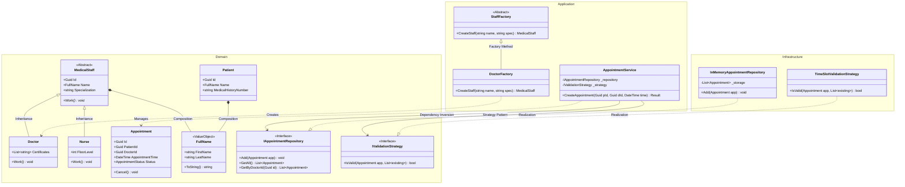

```mermaid
classDiagram
    %% Layer: Domain
    namespace Domain {
        class MedicalStaff {
            <<Abstract>>
            +Guid Id
            +FullName Name
            +string Specialization
            +Work() void*
        }

        class Doctor {
            +List~string~ Certificates
            +Work() void
        }

        class Nurse {
            +int FloorLevel
            +Work() void
        }

        class Patient {
            +Guid Id
            +FullName Name
            +string MedicalHistoryNumber
        }

        class Appointment {
            +Guid Id
            +Guid PatientId
            +Guid DoctorId
            +DateTime AppointmentTime
            +AppointmentStatus Status
            +Cancel() void
        }

        class FullName {
            <<ValueObject>>
            +string FirstName
            +string LastName
            +ToString() string
        }

        class IAppointmentRepository {
            <<Interface>>
            +Add(Appointment app) void
            +GetAll() List~Appointment~
            +GetByDoctorId(Guid id) List~Appointment~
        }

        class IValidationStrategy {
            <<Interface>>
            +IsValid(Appointment app, List~existing~ ) bool
        }
    }

    %% Layer: Application
    namespace Application {
        class AppointmentService {
            -IAppointmentRepository _repository
            -IValidationStrategy _strategy
            +CreateAppointment(Guid pId, Guid dId, DateTime time) Result
        }

        class StaffFactory {
            <<Abstract>>
            +CreateStaff(string name, string spec) MedicalStaff
        }

        class DoctorFactory {
            +CreateStaff(string name, string spec) MedicalStaff
        }
    }

    %% Layer: Infrastructure
    namespace Infrastructure {
        class InMemoryAppointmentRepository {
            -List~Appointment~ _storage
            +Add(Appointment app) void
        }
        
        class TimeSlotValidationStrategy {
            +IsValid(Appointment app, List~existing~) bool
        }
    }

    %% Relationships
    MedicalStaff <|-- Doctor : Inheritance
    MedicalStaff <|-- Nurse : Inheritance
    MedicalStaff *-- FullName : Composition
    Patient *-- FullName : Composition
    
    AppointmentService --> IAppointmentRepository : Dependency Inversion
    AppointmentService --> IValidationStrategy : Strategy Pattern
    
    InMemoryAppointmentRepository ..|> IAppointmentRepository : Realization
    TimeSlotValidationStrategy ..|> IValidationStrategy : Realization
    
    StaffFactory <|-- DoctorFactory : Factory Method
    DoctorFactory ..> Doctor : Creates
    
    AppointmentService ..> Appointment : Manages
```