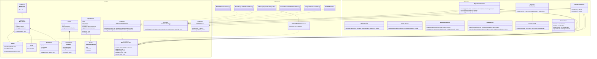

```mermaid
classDiagram
    %% Layer: Domain
    namespace Domain {
        class IEntity~TId~ {
            <<Interface>>
            +Id : TId
        }

        class MedicalStaff {
            <<Abstract>>
            +int Id
            +FullName Name
            +string Specialization
            +PerformDuty() void*
        }

        class Doctor {
            +List~string~ Certificates
            +int? DepartmentId
            +AssignToDepartment(int id) void
        }

        class Nurse {
            +int FloorLevel
        }

        class Department {
            +int Id
            +string Name
            +int Floor
            +Rename(string name) void
        }

        class Patient {
            +int Id
            +FullName Name
            +string MedicalCardNumber
        }

        class Appointment {
            +int Id
            +int PatientId
            +int DoctorId
            +DateTime AppointmentTime
            +AppointmentStatus Status
            +Confirm() void
            +Cancel() void
        }

        class FullName {
            <<ValueObject>>
            +string FirstName
            +string LastName
            +ToString() string
        }

        class AppointmentStatus {
            <<Enum>>
            New
            Confirmed
            Cancelled
        }

        class IRepository~T,TId~ {
            <<Interface>>
            +GetAll() IReadOnlyCollection~T~
            +GetById(TId id) T
            +Add(T entity) void
            +Update(T entity) void
            +Delete(TId id) void
        }

        class IAppointmentRepository {
            <<Interface>>
            +GetByDoctorId(int id) IReadOnlyCollection~Appointment~
            +GetByPatientId(int id) IReadOnlyCollection~Appointment~
        }

        class IValidationStrategy {
            <<Interface>>
            +IsValid(Appointment app, IReadOnlyCollection~Appointment~ existing) bool
        }

        class IDataStore~T~ {
            <<Interface>>
            +LoadAsync() Task~T~
            +SaveAsync(T data) Task
        }
    }

    %% Layer: Application
    namespace Application {
        class AppointmentService {
            +CreateAppointment(int patientId, int doctorId, DateTime time) Result
            +ConfirmAppointment(int id) Result
            +CancelAppointment(int id) Result
        }

        class PatientService {
            +RegisterPatient(string firstName, string lastName, string card) Result
        }

        class DoctorService {
            +RegisterDoctor(string fullName, string specialization) Result
        }

        class DepartmentService {
            +CreateDepartment(string name, int floor) Result
            +AssignDoctorToDepartment(int doctorId, int departmentId) Result
        }

        class QueryService {
            +GetActiveAppointments() IReadOnlyCollection~Appointment~
            +SearchPatients(string namePart, string cardPart) IReadOnlyCollection~Patient~
        }

        class PersistenceService {
            +LoadAsync() Result
            +SaveAsync() Result
        }

        class StaffFactory {
            <<Abstract>>
            +CreateStaff(int id, string name, string spec) MedicalStaff
        }

        class DoctorFactory {
            +CreateStaff(int id, string name, string spec) MedicalStaff
        }

        class MedCoreData {
            +Patients : List~Patient~
            +Doctors : List~Doctor~
            +Departments : List~Department~
            +Appointments : List~Appointment~
        }
    }

    %% Layer: Infrastructure
    namespace Infrastructure {
        class InMemoryRepository~T,TId~ {
            -Dictionary~TId,T~ storage
        }

        class InMemoryAppointmentRepository

        class JsonFileDataStore

        class TimeSlotValidationStrategy
        class DoctorDailyLimitValidationStrategy
        class PatientTimeConflictValidationStrategy
        class CompositeValidationStrategy
    }

    %% Relationships
    IEntity~TId~ <|.. MedicalStaff
    MedicalStaff <|-- Doctor
    MedicalStaff <|-- Nurse
    MedicalStaff *-- FullName
    Patient *-- FullName

    Appointment --> AppointmentStatus

    IAppointmentRepository ..|> IRepository~Appointment,int~
    InMemoryRepository~T,TId~ ..|> IRepository~T,TId~
    InMemoryAppointmentRepository --|> InMemoryRepository~Appointment,int~
    InMemoryAppointmentRepository ..|> IAppointmentRepository

    JsonFileDataStore ..|> IDataStore~MedCoreData~

    TimeSlotValidationStrategy ..|> IValidationStrategy
    DoctorDailyLimitValidationStrategy ..|> IValidationStrategy
    PatientTimeConflictValidationStrategy ..|> IValidationStrategy
    CompositeValidationStrategy ..|> IValidationStrategy

    AppointmentService --> IAppointmentRepository
    AppointmentService --> IRepository~Patient,int~
    AppointmentService --> IRepository~Doctor,int~
    AppointmentService --> IValidationStrategy

    PersistenceService --> IDataStore~MedCoreData~
    PersistenceService --> IRepository~Patient,int~
    PersistenceService --> IRepository~Doctor,int~
    PersistenceService --> IRepository~Department,int~
    PersistenceService --> IAppointmentRepository

    StaffFactory <|-- DoctorFactory
    DoctorFactory ..> Doctor
```