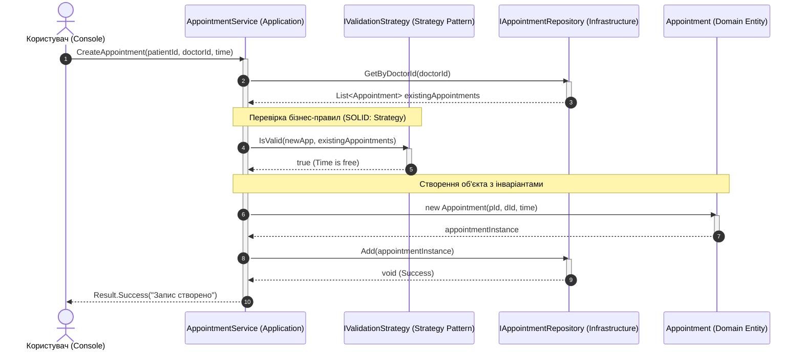

```mermaid
sequenceDiagram
    autonumber
    actor User as Користувач (Console)
    participant AppService as AppointmentService (Application)
    participant Strategy as IValidationStrategy (Strategy Pattern)
    participant Repo as IAppointmentRepository (Infrastructure)
    participant Entity as Appointment (Domain Entity)

    User->>AppService: CreateAppointment(patientId, doctorId, time)
    
    activate AppService
    AppService->>Repo: GetByDoctorId(doctorId)
    activate Repo
    Repo-->>AppService: List<Appointment> existingAppointments
    deactivate Repo

    Note over AppService, Strategy: Перевірка бізнес-правил (SOLID: Strategy)
    AppService->>Strategy: IsValid(newApp, existingAppointments)
    activate Strategy
    Strategy-->>AppService: true (Time is free)
    deactivate Strategy

    Note over AppService, Entity: Створення об'єкта з інваріантами
    AppService->>Entity: new Appointment(pId, dId, time)
    activate Entity
    Entity-->>AppService: appointmentInstance
    deactivate Entity

    AppService->>Repo: Add(appointmentInstance)
    activate Repo
    Repo-->>AppService: void (Success)
    deactivate Repo

    AppService-->>User: Result.Success("Запис створено")
    deactivate AppService
```