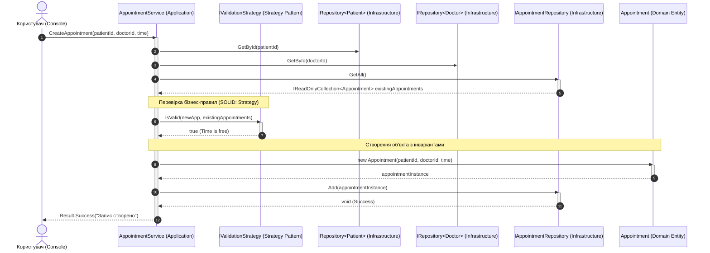

```mermaid
sequenceDiagram
    autonumber
    actor User as Користувач (Console)
    participant AppService as AppointmentService (Application)
    participant Strategy as IValidationStrategy (Strategy Pattern)
    participant PatientRepo as IRepository<Patient> (Infrastructure)
    participant DoctorRepo as IRepository<Doctor> (Infrastructure)
    participant Repo as IAppointmentRepository (Infrastructure)
    participant Entity as Appointment (Domain Entity)

    User->>AppService: CreateAppointment(patientId, doctorId, time)
    
    activate AppService
    AppService->>PatientRepo: GetById(patientId)
    AppService->>DoctorRepo: GetById(doctorId)
    AppService->>Repo: GetAll()
    activate Repo
    Repo-->>AppService: IReadOnlyCollection<Appointment> existingAppointments
    deactivate Repo

    Note over AppService, Strategy: Перевірка бізнес-правил (SOLID: Strategy)
    AppService->>Strategy: IsValid(newApp, existingAppointments)
    activate Strategy
    Strategy-->>AppService: true (Time is free)
    deactivate Strategy

    Note over AppService, Entity: Створення об'єкта з інваріантами
    AppService->>Entity: new Appointment(patientId, doctorId, time)
    activate Entity
    Entity-->>AppService: appointmentInstance
    deactivate Entity

    AppService->>Repo: Add(appointmentInstance)
    activate Repo
    Repo-->>AppService: void (Success)
    deactivate Repo

    AppService-->>User: Result.Success("Запис створено")
    deactivate AppService
```